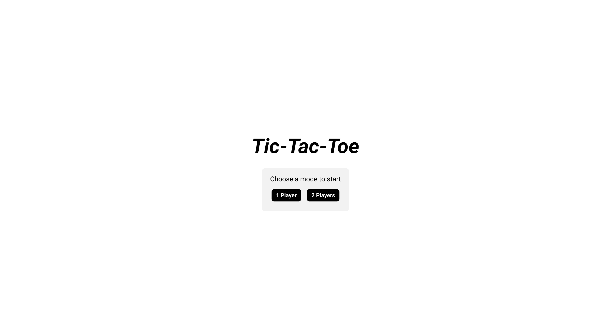
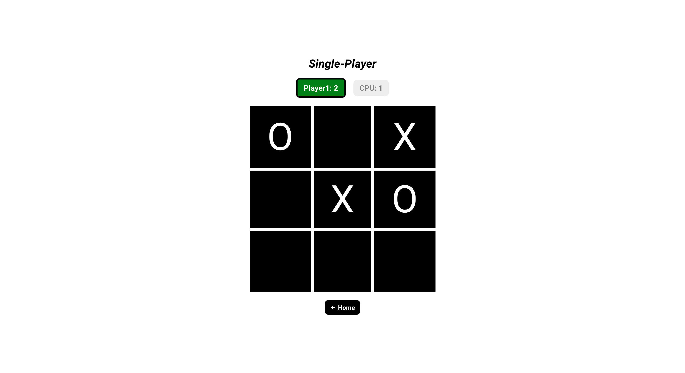

## Tic-Tac-Toe Game

Tic-tac-toe the game, built with React, JavaScript, and CSS.

## Screen Shots(s)

## Installation and Setup Instructions

Clone this repository (You will need `node` and `npm` installed globally on your machine)

Installation:

`npm install`

To Start Client:

`npm start`

To Visit App:

`localhost:3000`

## Summary

- Application features:
    - Play tic-tac-toe with either the computer or a second player
- What was the purpose of this project?
    - Practicing front-end development using the React library
    - Deploying a React app to Heroku
    - Creating an app that focuses on game design and logic